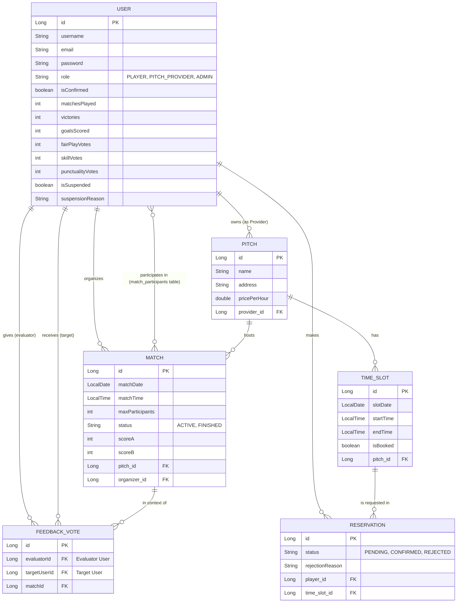

# Documentația Proiectului: Community Football Manager

## 1. Introducere

**Community Football Manager** este o aplicație web dezvoltată cu scopul de a digitaliza și facilita organizarea meciurilor de fotbal la nivel de comunitate. În mod tradițional, organizarea unui meci amator implică multiple conversații pe grupuri de mesagerie, dificultăți în găsirea unui teren disponibil și lipsa unei evidențe clare a participanților. Această aplicație rezolvă aceste probleme oferind o platformă centralizată unde pasionații de fotbal se pot întâlni virtual, pot rezerva terenuri și își pot construi un profil de jucător.

Platforma conectează direct cererea (jucătorii amatori) cu oferta (proprietarii sau administratorii de baze sportive). Mai mult decât un simplu utilitar de rezervări, aplicația integrează elemente de "gamification" – monitorizarea victoriilor, a golurilor marcate și un sistem de reputație bazat pe voturile comunității (Fair-play, Skill, Punctualitate) – promovând astfel un mediu sportiv competitiv, dar corect și civilizat.

---

## 2. Cerințe Funcționale

Sistemul este proiectat să deservească trei categorii principale de actori, fiecare cu un set distinct de permisiuni și responsabilități: **Jucător (PLAYER)**, **Furnizor de Terenuri (PITCH_PROVIDER)** și **Administrator (ADMIN)**.

### 2.1. Funcționalități Generale și Autentificare
*   **Înregistrarea Utilizatorilor:** Utilizatorii pot crea conturi noi, având posibilitatea de a opta pentru rolul de PLAYER sau PITCH_PROVIDER. Din motive de securitate, sistemul respinge automat tentativele de înregistrare cu rolul de ADMIN.
*   **Confirmarea Contului:** Pentru validarea adreselor, sistemul trimite automat un email de confirmare cu un link unic. Conturile neconfirmate nu se pot autentifica.
*   **Autentificarea (Login) și Gestiunea Sesiunii:** Accesul în aplicație se face pe baza adresei de email și a parolei. Sistemul verifică statusul contului (confirmat, nesuspendat).
*   **Recuperarea Parolei:** Utilizatorii care și-au uitat parola pot solicita resetarea acesteia. Sistemul generează o parolă temporară și o expediază pe email.

### 2.2. Modulul pentru Jucători (PLAYER)
*   **Crearea unui Meci (UC5):** Un jucător (care devine automat "Organizator") poate crea un meci alegând un teren din lista celor disponibile, stabilind data, ora și numărul maxim de participanți. Sistemul validează disponibilitatea terenului pentru a preveni suprapunerile.
*   **Înscrierea la Meciuri (UC6):** Jucătorii pot explora lista de meciuri "ACTIVE" și se pot înscrie, cu condiția ca limita de participanți să nu fi fost atinsă, iar jucătorul să nu fie deja înscris.
*   **Finalizarea Meciului și Actualizarea Statisticilor (UC7):** După disputarea partidei, Organizatorul este responsabil cu închiderea meciului în aplicație. El introduce scorul final și atribuie golurile și victoriile participanților. Aplicația validează strict aceste date (ex: suma golurilor individuale nu poate depăși scorul total al echipei). Datele validate actualizează profilul permanent al jucătorilor (Meciuri Jucate, Goluri, Victorii).
*   **Istoricul Meciurilor și Sistemul de Feedback (UC11):** Jucătorii își pot vizualiza istoricul meciurilor "FINISHED". Pentru meciurile la care au participat, ei pot acorda un vot de reputație celorlalți jucători (Fair-play, Skill, Punctualitate). Sistemul previne auto-votul și limitarea la un singur vot pe categorie/jucător/meci.

### 2.3. Modulul pentru Furnizorii de Terenuri (PITCH_PROVIDER)
*   **Gestiunea Bazei Sportive:** Furnizorii pot adăuga terenuri noi pe platformă, specificând detalii precum numele bazei, adresa exactă și tariful orar.
*   **Gestionarea Rezervărilor:** (Conform modelului de date) Furnizorii pot vizualiza cererile de rezervare pe intervale orare (TimeSlots) făcute de jucători și le pot aproba (CONFIRMED) sau respinge (REJECTED), furnizând un motiv pentru respingere.

### 2.4. Modulul de Administrare (ADMIN)
*   **Moderarea Comunității:** Administratorii au capacitatea de a vizualiza toți utilizatorii și de a suspenda conturile (setând `isSuspended = true` și adăugând un `suspensionReason`). Utilizatorii suspendați nu se mai pot autentifica.

---

## 3. Unelte Utilizate

Pentru dezvoltarea proiectului "Community Football Manager", a fost selectat un stack tehnologic robust, bazat pe ecosistemul Java, recunoscut pentru stabilitate, scalabilitate și securitate în dezvoltarea aplicațiilor web de tip enterprise.

### 3.1. Backend Framework: Spring Boot 4.0.6
Proiectul folosește **Spring Boot**, cadrul de dezvoltare principal în ecosistemul Java modern. Motivul principal pentru alegerea Spring Boot este convenția peste configurare (convention over configuration), care elimină necesitatea fișierelor XML complexe (ex. web.xml) și accelerează timpul de dezvoltare.
*   **Spring Web MVC:** Utilizat pentru crearea arhitecturii web și expunerea endpoint-urilor. Controlează fluxul HTTP, primește cererile (GET, POST), le rutează către funcțiile din controllere și returnează view-urile corespunzătoare.
*   **Spring Boot Mail:** Integrat pentru a facilita comunicarea asincronă cu utilizatorii. Folosește serverul SMTP de la Google (Gmail) pentru a expedia link-uri de confirmare a conturilor noi și parole temporare în cazul recuperării contului.

### 3.2. Limbajul de Programare: Java 21
S-a optat pentru **Java 21**, o versiune Long-Term Support (LTS). Java asigură un sistem de tipuri puternic, programare orientată pe obiecte strictă și performanțe excelente datorită optimizărilor recente din JVM (Java Virtual Machine). Alegerea Java 21 permite utilizarea noilor funcționalități ale limbajului, scriind un cod mai curat și mai eficient.

### 3.3. Baza de Date și ORM (Object-Relational Mapping)
*   **MySQL:** Un sistem de gestiune a bazelor de date relaționale (RDBMS) consacrat, ales pentru viteza și fiabilitatea sa. Modelează perfect natura relațională a datelor din această aplicație (ex: Relația de tip Many-to-Many între Meciuri și Jucători). Pentru conexiune se folosește driver-ul `mysql-connector-j`.
*   **Spring Data JPA & Hibernate:** În loc de a scrie interogări SQL manuale (ceea ce predispune la erori și vulnerabilități precum SQL Injection), aplicația folosește Hibernate ca implementare JPA (Java Persistence API). Entitățile Java (clasele din model) sunt mapate direct pe tabelele din baza de date folosind adnotări (`@Entity`, `@Table`, `@OneToMany`). Proprietatea `spring.jpa.hibernate.ddl-auto=update` asigură sincronizarea automată a structurii bazei de date cu codul Java.

### 3.4. Frontend și Tehnologii Web
*   **JSP (JavaServer Pages):** Ca motor de templating, s-a ales JSP. Deși este o tehnologie mai clasică în comparație cu framework-urile moderne tip SPA (React, Angular), JSP se integrează nativ cu Spring MVC și Servlet-urile Java.
*   **JSTL (JSP Standard Tag Library):** Utilizat extensiv (`<c:forEach>`, `<c:if>`) pentru a genera conținut HTML dinamic pe baza structurilor de date trimise de server (ex: iterarea peste lista de meciuri sau de terenuri disponibile).

### 3.5. Server Web și Managementul Dependințelor
*   **Apache Tomcat (Embedded):** Datorită Spring Boot, aplicația vine la pachet cu propriul server web Tomcat. Acest lucru înseamnă că aplicația poate fi rulată independent (ca un fișier JAR/WAR autonom) fără a necesita o instalare și configurare separată a unui server de aplicații pe mașina gazdă.
*   **Maven:** Utilizat ca instrument de management al proiectului și al dependințelor. Fișierul `pom.xml` centralizează toate bibliotecile externe necesare (librăriile Spring, driver-ul MySQL, JSTL), asigurând consistența build-ului pe orice mașină de dezvoltare.

## 4. Arhitectura Proiectului

Aplicația **Community Football Manager** este construită pe o arhitectură **Monolitică**, structurată intern pe baza modelului arhitectural **MVC (Model-View-Controller)** și organizată pe straturi (Layered Architecture). Această decizie arhitecturală este ideală pentru proiecte de dimensiuni medii unde coeziunea logică și simplitatea implementării și deployment-ului sunt prioritare.

### 4.1. Structura pe Straturi (Layered Architecture)

Codul sursă este organizat logic în mai multe pachete sub `com.cmf.community_football_manager`, fiecare având o responsabilitate unică, respectând principiul *Separation of Concerns*:

1.  **Stratul de Prezentare (View & Controller):**
    *   **Views (`src/main/webapp/WEB-INF/jsp/`):** Aici rezidă fișierele `.jsp`. Ele sunt pasive și conțin doar logica minimă de afișare (folosind JSTL). Nu accesează niciodată baza de date direct.
    *   **Controllers (`/controller`):** Clasele adnotate cu `@Controller` (ex: `AuthController`, `MatchController`). Acestea interceptează cererile HTTP trimise de utilizator (ex: un formular de creare meci). Ele extrag datele din cerere, validează logica de business, apelează stratul de date și apoi populează un obiect `Model` (un fel de dicționar de date) care este trimis mai departe către View pentru a fi randat.

2.  **Stratul de Date (Model & Repository):**
    *   **Model (`/model`):** Conține entitățile aplicației (`User`, `Match`, `Pitch`, `Reservation`, `FeedbackVote`). Acestea sunt clase Java simple (POJO) adnotate specific JPA (`@Entity`, `@Id`, `@Column`). Ele reprezintă structura tabelelor din baza de date și mențin starea aplicației. Mai mult, ele modelează relațiile (ex: `Match` are un `@ManyToMany` cu `User` pentru participanți).
    *   **Repository (`/repository`):** Conține interfețe care extind `JpaRepository`. Aici, Spring Data JPA generează automat la runtime implementarea pentru operațiile CRUD (Create, Read, Update, Delete) și query-uri personalizate pe baza denumirii metodelor (ex: `matchRepository.existsByPitchIdAndMatchDateAndMatchTime(...)`). Acest strat ablaționează complet complexitatea interogărilor SQL.

3.  **Stratul de Servicii (`/service`):**
    *   Acolo unde logica este independentă de fluxul web, este extrasă în servicii (adnotate cu `@Service`). De exemplu, `EmailService` encapsulează toată logica necesară construirii și trimiterii email-urilor de confirmare, decuplând acest comportament de controller-ul de autentificare.

### 4.2. Gestiunea Sesiunilor și Securitatea (Custom Auth)

Un aspect notabil al arhitecturii este decizia de a **nu** utiliza un framework greu precum Spring Security, ci de a implementa un mecanism custom de gestiune a sesiunilor folosind API-ul nativ `HttpSession` din Servlet-uri.

*   **Fluxul de Login:** Când utilizatorul introduce datele corecte în `AuthController`, controller-ul creează o sesiune HTTP legată de browser-ul utilizatorului și stochează obiectul `User` extras din baza de date direct în sesiune: `session.setAttribute("loggedInUser", user)`.
*   **Autorizarea (Authorization):** Pe fiecare metodă din `MatchController` sau `ProviderController` care necesită autentificare, primul pas este preluarea utilizatorului din sesiune. Dacă `session.getAttribute("loggedInUser") == null`, cererea este respinsă și utilizatorul este redirectat imediat (`return "redirect:/login";`).
*   **Validarea Permisiunilor (Role-Based Access):** După verificarea logării, logica din controllere aplică reguli de autorizare specifice. De exemplu, în funcția de finalizare a unui meci (`finish-match-form`), sistemul verifică: `match.getOrganizer().getId().equals(loggedInUser.getId())`. Dacă utilizatorul curent nu este cel care a organizat meciul, actiunea îi este interzisă.

Această abordare este mai ușor de înțeles și depanat pentru o aplicație academică sau de dimensiuni mici, dar menține totuși integritatea logică a datelor și previne accesul neautorizat la resurse.

### 4.3. Procesarea Datelor și Integritatea (Business Logic Validations)

Arhitectura plasează un accent puternic pe validările "Server-Side" executate în Controller înainte ca datele să atingă Repository-ul. Exemple arhitecturale din proiect:
*   **Prevenirea coliziunilor fizice:** Când un meci este creat (`MatchController.createMatch`), se face un query preventiv pentru a vedea dacă un meci există deja la acel teren (`pitchId`), la acea dată (`matchDate`) și oră (`matchTime`). Dacă există, tranzacția este anulată imediat, iar utilizatorul primește feedback.
*   **Prevenirea stărilor imposibile:** La introducerea scorului (UC7), controller-ul face suma tuturor golurilor declarate de organizator pentru fiecare jucător. Dacă suma matematică depășește scorul total general declarat al meciului, sistemul aruncă o eroare logică, protejând acuratețea datelor statistice pe termen lung din tabela `User`.

## 5. Diagrama Entitate-Relație (ERD)

Mai jos este prezentată diagrama care modelează structura bazei de date și relațiile dintre entitățile principale ale aplicației:

### Explicația Relațiilor Principale:
1. **User - Match (Organizator):** Relație `One-to-Many`. Un utilizator poate organiza mai multe meciuri, dar un meci are un singur organizator (`organizer_id` în `Match`).
2. **User - Match (Participanți):** Relație `Many-to-Many`. Un meci are o listă de participanți (`List<User> participants`), iar un jucător poate fi înscris la mai multe meciuri. Aceasta se rezolvă în baza de date printr-o tabelă de legătură `match_participants`.
3. **User - Pitch:** Relație `One-to-Many`. Un furnizor (PITCH_PROVIDER) deține mai multe terenuri, un teren aparține unui singur furnizor (`provider_id`).
4. **Pitch - Match:** Relație `One-to-Many`. Pe un teren se pot juca mai multe meciuri, un meci are loc pe un singur teren.
5. **Sistemul de Feedback:** `FeedbackVote` este o entitate tranzacțională care leagă un Utilizator Evaluator, un Utilizator Țintă (cel evaluat) și Meciul în contextul căruia s-a acordat votul, asigurând trasabilitatea și prevenind votul multiplu.